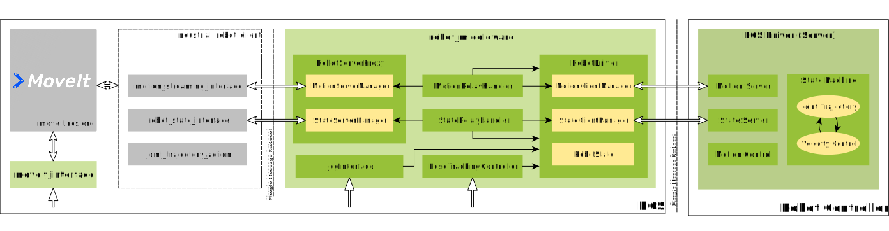

# Adaptive Motion Control Middleware

## Overview

The *Adaptive Motion Control Middleware* was developed at the [Institute for Factory Automation and Production Systems (FAPS)][faps] and is used for the teleoperation of industrial robots. For intuitive control of the robot by the (tele)operator, different motion control modes (collision-free motion planning, jogging, pose tracking) are necessary. In addition, adaptive switching between these is desired.

The motion control system was implemented using ROS 1 as framework. Here, the already existing ROS drivers (based on [industrial_robot_client][], [simple_message][]) for Staubli/Motoman robots served as the basis for our work. The ability to plan and execute collision-free trajectories was thus provided by [MoveIt][] and [ROS-Industrial][]. Additionally, the motion control modes *Jogging* and *Pose Tracking* were implemented within the middleware.

For the execution of the additional motion control modes on the robot controller, a *Velocity Control* capability was first implemented in the robot-specific part of the driver (server). With the help of a state machine, the driver switches to the desired mode as required. The customized drivers for Staubli and Motoman robots can be found in the following Git repositories (forks):

| Robot vendor | Repository                                      | Branch     |
| ---          | ---                                             | ---        |
| Staubli      | https://github.com/FAU-FAPS/motoman             | faps-devel |
| Motoman      | https://github.com/FAU-FAPS/staubli_val3_driver | faps-devel |

The middleware is implemented as a standalone ROS node `robot_middleware` and is integrated into the architecture of the ROS driver as a kind of abstraction layer (see diagram below). On the one hand, the middleware connects to the driver (motion and state server) on the robot controller. By direct access to the motion and state interfaces it is possible to implement an open or closed loop controller. On the other hand, the ROS-Industrial nodes (motion/state interfaces) connect to the middleware instead of the real robot. The communication between the robot and ROS is tunneled through the middleware. The `JogInterface` and `PoseTrackingController` classes implement both a control loop in a separate thread and wait for motion commands on ROS topics to be activated. The `RobotDriver` class manages the connections to the robot controller and the active motion control mode within the middleware. By a certain locking mechanism it ensures that only one motion control mode can be active at a time.

<a id="architecture"></a>


There is also a thin interface to MoveIt, which is provided in a separate ROS node `moveit_interface`. The planning and execution of a trajectory is made possible here by simple ROS services.

**CAUTION**: In contrast to MoveIt, there is no collision checking for *Jogging* and *Pose Tracking*. The user or the client application should take care of collision avoidance.

## License

[](https://opensource.org/licenses/Apache-2.0)
[](https://opensource.org/licenses/BSD-3-Clause)

The core part of this repository is the `robot_middleware` package and it is licensed under the **Apache 2.0** license. All other packages are licensed under the **BSD 3-Clause** license. See also the `package.xml` file in each package for license information. The full license texts for both licences can be found in the [LICENSE](./LICENSE) file.

## Citation

If you use this code in your research, please cite the following paper:

> Andreas Blank, Engin Karlidag, Lukas Zikeli, Maximilian Metzner and Jörg Franke, “Adaptive Motion Control Middleware for Teleoperation based on Pose Tracking and Trajectory Planning,” in Annals of Scientific Society for Assembly, Handling and Robotics, Berlin, Heidelberg: Springer, 2021

## Prerequisites

As the `robot_middleware` does not replace the ROS driver based on the `industrial_robot_client` but rather extends its functionality, you will need the corresponding drivers to have a fully working system as shown in the [diagram](#architecture) above. We provide customized drivers for Staubli and Motoman robots.

### Staubli

The [staubli_val3_driver](https://github.com/FAU-FAPS/staubli_val3_driver/tree/faps-devel/staubli_val3_driver) package contains the modified VAL3 code (server) and additional/modified ROS-I client interface nodes. First, you should install the VAL3 application on the robot controller. Please refer to the instructions in the [README](https://github.com/FAU-FAPS/staubli_val3_driver/blob/faps-devel/staubli_val3_driver/README.md) file. The nodes can be built with catkin as described in the [Building](#building) section.

It is recommended to test the VAL3 application on Staubli's emulator in the *Staubli Robotics Suite (SRS)* first. Note that some functionality that rely on the real-time capabilities of the robot controller (i.e. *Jogging*, *Pose Tracking*) may not work properly with the emulator.

### Motoman

The [motoman_driver](https://github.com/FAU-FAPS/motoman/tree/faps-devel/motoman_driver) package contains the modified MotoPlus code (server) and the ROS-I client interface nodes. First, you should install the MotoPlus application on the robot controller. Please refer to the instructions in the [README](https://github.com/FAU-FAPS/motoman/tree/faps-devel#installation-and-usage) file. The nodes can be built with catkin as described in the [Building](#building) section.

The MotoPlus application is provided as a built binary (.out file) in the [MotoPlus/output](https://github.com/FAU-FAPS/motoman/tree/faps-devel/motoman_driver/MotoPlus/output) folder for each controller. The modified version (with *Velocity Control*) was only built for the FS100 and YRC1000 controllers (only tested with these). They can also be distinguished by their suffix `_velocity.out` from the others. The modified MotoPlus code does not support the DX100 controller but may work with the other controllers.

## Building

This package was developed and tested with ROS Melodic under Linux Mint 19 (based on Ubuntu 18.04). It can be built with the following instructions assuming ROS was installed properly and catkin_tools is used as the build tool.

Create a catkin workspace (if not done already) and clone this repository:

```bash
# source the ROS environment
source /opt/ros/melodic/setup.bash

# create and init a catkin workspace
mkdir -p $HOME/catkin_ws/src && cd $HOME/catkin_ws && catkin init

# clone this repository
git clone https://github.com/FAU-FAPS/adaptive_motion_control.git src/adaptive_motion_control
```

### Robot specific dependencies

Depending on which robot is used (Staubli/Motoman) the corresponding dependencies must be cloned and built from source. These are not required to build this package but they contain the ROS-I interface nodes required for the complete system architecture as shown in the [diagram](#architecture) above.

#### Staubli

Clone the modified driver package:

```bash
git clone -b faps-devel https://github.com/FAU-FAPS/staubli_val3_driver.git src/staubli_val3_driver
```

Clone also the support packages for Staubli if necessary:

```bash
git clone https://github.com/ros-industrial/staubli.git src/staubli
git clone https://github.com/ros-industrial/staubli_experimental.git src/staubli_experimental
```

*Note: The support packages are required for running the example MoveIt package `staubli_tx60l_moveit_config` included in this repository.*

#### Motoman

Clone the modified driver package:

```bash
git clone -b faps-devel https://github.com/FAU-FAPS/motoman.git src/motoman
```

### Building the workspace

Finally, install missing dependencies and build the packages:


```bash
# install package dependencies (--os parameter not required under Ubuntu)
rosdep install --from-paths src/ --ignore-src -y --os=ubuntu:bionic

# build the workspace
catkin build
```

*Note: If the `rosdep install` command complains that it can't resolve some dependencies (which are not required for your use-case), then you can try the `-r` parameter to continue despite errors.*

### Activating the workspace

Activate the workspace to be able to use the freshly built packages:

```bash
source $HOME/catkin_ws/devel/setup.bash
```

## Usage

We provide two example MoveIt config packages, one for a Yaskawa Motoman HC10 and one for a Staubli TX60L to demonstrate how the `robot_middleware` can be used in conjunction with MoveIt.

The `robot_middleware` node requires many parameters. Example values are given in the included config and launch files. See the `<robot_name>_middleware.launch` and `<robot_name>_middleware.yaml` files in the corresponding package. The MoveIt/ROS-Industrial components can be started with the `moveit_planning_execution.launch` file. See the file for more information about the available arguments and parameters. The following instructions will start all required nodes to achieve the system architecture shown in the graph in the [Overview](#overview) section.

### Motoman HC10

1. Start the `robot_middleware` node with all required parameters and connect to the robot:

        roslaunch motoman_hc10_moveit_config motoman_hc10_middleware.launch robot_ip:=<robot_ip>

2. Start the MoveIt/ROS-Industrial components (and connect the motion/state interfaces to the middleware):

        roslaunch motoman_hc10_moveit_config moveit_planning_execution.launch robot_ip:=<robot_ip> use_middleware:=true

3. Start the `moveit_interface` node:

        rosrun moveit_interface moveit_interface _planning_group:=manipulator


### Staubli TX60L

1. Start the `robot_middleware` node with all required parameters and connect to the robot:

        roslaunch staubli_tx60l_moveit_config staubli_tx60l_middleware.launch robot_ip:=<robot_ip>

2. Start the MoveIt/ROS-Industrial components (and connect the motion/state interfaces to the middleware):

        roslaunch staubli_tx60l_moveit_config moveit_planning_execution.launch robot_ip:=<robot_ip> use_middleware:=true

3. Start the `moveit_interface` node:

        rosrun moveit_interface moveit_interface _planning_group:=manipulator


[simple_message]: http://wiki.ros.org/simple_message
[industrial_robot_client]: http://wiki.ros.org/industrial_robot_client
[faps]: https://www.faps.fau.eu/
[moveit]: https://moveit.ros.org/
[ros-industrial]: http://wiki.ros.org/Industrial
